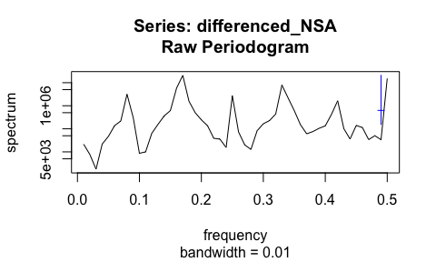
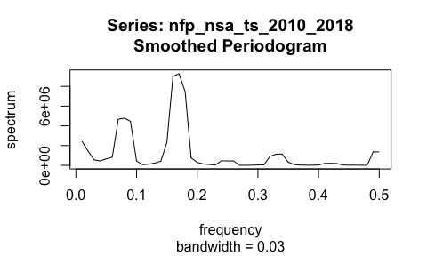

## Spectral Analysis

We aim to use spectral analysis to find the key frequencies of variation in the non-seasonally adjusted NFP time series.

### Raw Periodogram

We begin our spectral analysis by detrending the spectral density using a first difference and estimating the spectral density of the detrended time series using a raw periodogram.


```r
PAYNSA <- read.csv(file = "PAYNSA.csv", header = TRUE, sep = ",")
nfp_nsa_ts_2010_2018 <- ts(PAYNSA[853:951, ][2])
plot.ts(nfp_nsa_ts_2010_2018, main = "Non Seasonally Adjusted NFP Data")
```

<!-- -->

```r
differenced_NSA <- diff(nfp_nsa_ts_2010_2018)
plot.ts(differenced_NSA, main = "First DIfference of NSA Data")
```

<!-- -->

```r
mvspec(differenced_NSA, detrend = FALSE)
```

<!-- -->

```r
mvspec(nfp_nsa_ts_2010_2018)
```

<!-- -->

The raw periodogram of the differenced NSA data shows 5 major peaks corresponding to cycles of approximately 12 months, 6 months, 4 months, 3 months, and 2.5 months.

Compared to the raw periodogram of the data detrended using the mvspec default, the raw periodogram of the differenced NSA data has a lower baseline around most peaks. We will compare the smoothed periodograms of the differenced and detrended data as well.

### Smoothing the Periodogram

To improve our spectral estimator, we will smooth the periodogram using various parameters to find a better estimate of the spectral density. First we use a daniell kernel with m = 4.


```r
k = kernel("daniell", 4)
mvspec(differenced_NSA, k, log = "no")
```

<!-- -->

```r
mvspec(nfp_nsa_ts_2010_2018, k, log = "no")
```

<!-- -->

The smoothed periodgram shows the greatest variance in the 0.13 to 0.21 frequency range, which corresponds to one cycle every 5-7 months, or approximately a semiannual cycle. There is also a smaller peak at 0.46, corresponding to a cycle every 2 months, and a third peak at 0.29 to 0.37, corresponding to a cycle every 2.7-3.4 months, or a quarterly cycle.

The smoothed periodogram of the detrended data has a sharp peak at 0.04 and much lower peaks in the 2 month and quarterly cycle frequency range. Based on visual inspection of the time series plot, we believe that the peaks in the quarterly cycle frequency range in particular represent key frequencies of variation, suggesting that the differenced data set produces a smoothed periodogram with more significant peaks.

Now we set taper to 0.1. ADD REASONING.


```r
# mvspec(nfp_nsa_ts_2010_2018, k, log="no", taper = 0.1)
mvspec(differenced_NSA, k, log="no", taper = 0.1)
```

<!-- -->

The tapering does not change the estimate spectral density significantly and the same frequency peaks remain. This suggests our data set has very clean and predictable cyclical variation.

### Parametric Spectral Estimation

Based on our findings from the ARIMA modeling process, we believe a lagged difference with lag = 12 months and differencing again produces a stationary transformed time series that closely resembles white noise. Therefore, we concluded that fitting an ARMA model with non-zero order would not produce useful information. This suggests that parametric spectral estimation is a poor method for estimating the spectral density, because for all non-zero p, an AR(p) model would produce a poor fit and introduce a dependency structure to uncorrelated white nosie, creating bias in the estimated spectral density.
