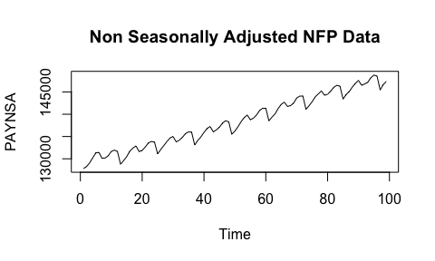
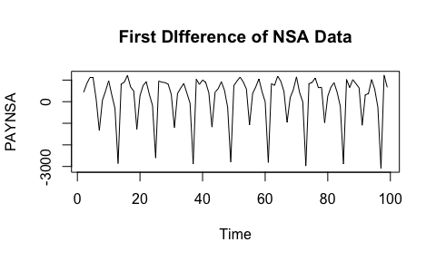

# Project NFP - Spectral Analysis
Sam Choi, Eric Xu  
4/11/2018  


## Spectral Analysis

We aim to use spectral analysis to find the key frequencies of variation in the non-seasonally adjusted NFP time series. We begin our spectral analysis by estimating the spectral density using a raw periodogram.


```r
PAYNSA <- read.csv(file = "PAYNSA.csv", header = TRUE, sep = ",")
nfp_nsa_ts_2010_2018 <- ts(PAYNSA[853:951, ][2])
plot.ts(nfp_nsa_ts_2010_2018, main = "Non Seasonally Adjusted NFP Data")
```

<!-- -->

```r
spec.pgram(nfp_nsa_ts_2010_2018)
```

<!-- -->

Now we use a smoothed periodogram with various parameters to find a better estimate of the spectral density.
