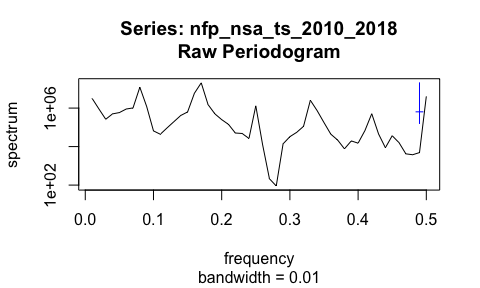
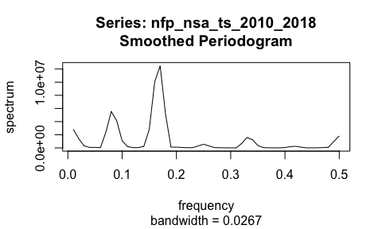
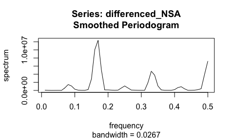

## Spectral Analysis

<<<<<<< HEAD
We aim to use spectral analysis to find the key frequencies of variation in the non-seasonally adjusted NFP time series. We begin our spectral analysis by detrending the spectral density using a first difference and estimating the spectral density of the detrended time series using a raw periodogram.
=======
We aim to use spectral analysis to find the key frequencies of variation in the non-seasonally adjusted NFP time series.

### Raw Periodogram

We begin our spectral analysis by detrending the spectral density using a first difference and estimating the spectral density of the detrended time series using a raw periodogram.
>>>>>>> f378000931b9402cb7700d4c6d649845928ccb4b


```r
PAYNSA <- read.csv(file = "PAYNSA.csv", header = TRUE, sep = ",")
nfp_nsa_ts_2010_2018 <- ts(PAYNSA[853:951, ][2])
plot.ts(nfp_nsa_ts_2010_2018, main = "Non Seasonally Adjusted NFP Data")
```

<!-- -->

```r
mvspec(nfp_nsa_ts_2010_2018)
```

<!-- -->

```r
detrend <- diff(nfp_nsa_ts_2010_2018)
plot.ts(detrend)
```

<!-- -->

```r
mvspec(detrend, detrend = FALSE)
```

<!-- -->

The raw periodogram shows 5 major peaks corresponding to cycles of approximately 12 months, 6 months, 4 months, 3 months, and 2.5 months.

<<<<<<< HEAD
=======
### Smoothing the Periodogram

>>>>>>> f378000931b9402cb7700d4c6d649845928ccb4b
Now we use a smoothed periodogram with various parameters to find a better estimate of the spectral density. First we use a daniell kernel with m = 4.


```r
k = kernel("daniell", 4)
mvspec(nfp_nsa_ts_2010_2018, k, log="no")
```

<!-- -->

```r
mvspec(detrend, k, log="no")
```

<!-- -->

The smoothed periodgram shows the greatest variance in the 0.13 to 0.21 frequency range, which corresponds to one cycle every 5-7 months, or a semiannual cycle. There is also a smaller peak at 0.46, corresponding to a cycle every 2 months, and a third peak at 0.29 to 0.37, corresponding to a cycle every 2.7-3.4 months, or a quarterly cycle.

<<<<<<< HEAD
Now we use a danielle kernel.
=======
Now we set taper to 0.1. ADD REASONING.
>>>>>>> f378000931b9402cb7700d4c6d649845928ccb4b


```r
mvspec(nfp_nsa_ts_2010_2018, k, log="no", taper = 0.1)
```

<!-- -->

```r
mvspec(detrend, k, log="no", taper = 0.1)
```

<!-- -->
